<iframe width="854" height="480" src="https://www.youtube.com/embed/tyh07c5I7eU" frameborder="0" gesture="media" allow="encrypted-media" allowfullscreen></iframe>
<a class="tar_download_link" href="http://nbviewer.jupyter.org/urls/lauroflorin.github.io/Explainer_notebook%20(3).ipynb">View Explainer Notebook</a>   |   <a class="zip_download_link" href="https://drive.google.com/uc?export=download&confirm=PCfU&id=12LJdIPyeeYTZ0U-7ZODdFa417IctEwR0">Download datasets(.zip)</a>

# Motivation
We wanted to find out whether humans have realized that lab rats and dolphins are smarter than them as per Hitchhiker's Guide. So our question is: who’s the smartest animal in town? Our team decided that the best way to find out was to search the deep dark web of Facebook.

 __Choice of dataset__

Upon a search for the most relevant Facebook groups, 3 stood out (they had the most members, >5000): Animal Cognition, Anthrozoology and Animal Cognition, the Emotional and Intellectual Lives of Animals. Our assumption is that everything posted on these groups is scientific and related to the intelligence of animals (due to the groups' names), so therefore if a post on these groups mentions an animal, that animal must be smart. 

# Basic stats about the dataset

After using Facebook's API to download all the required materials, we ended up with the following datasets:

* __Animal Cognition:__
    - 6 956 posts
    - 4726 members
    - 9779 comments
    - 11887 mentioned animals

* __Animal Cognition, the Emotional and Intellectual Lives of Animals:__
    - 10 364 posts
    - 4825 members
    - 7928 comments
    - 15316 mentioned animals

* __Anthrozoology:__
    - 7 442 posts
    - 3200 members
    - 13750 comments
    - 9331 mentioned animals

* 24 762 posts in total, 78.3 MB of pickles

Also, Wikipedia was mined for a list of animals by common name. This list was chosen because it seemed the most relevant, as people mention animals by their common name (as opposed to the scientific one) when posting about them on facebook.
# Network Analysis
The main network is a multipartite graph made of 3 types of nodes: users, posts and animals. 
* Nodes:
    - Group members by ID
    - Posts by ID with post data as attribute
    - Animals by name
* Edges:
    - Members - posts: if a member posted/liked/commented on the post (with post/like/comment as edge attribute)
    - Posts - animals: if the animal is the subject of the post
 
 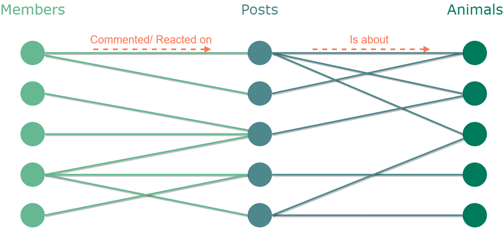

 We can do a preliminary betweenness centrality analysis to see which nodes are central in terms of the shortest path between the nodes. After that, we will project the animal subgraph and analyze it more in depth.
 
|Node|Betweenness Centrality|
|----|----------------------|
|user_1322360307909727 |0.160884981514|
|user_10216027383903846| 0.139725685894|
|user_10155670551195985| 0.0837083637737|
|user_10214955589106892| 0.0575954930295|
|user_1720034408041981 |0.0510354890295|
|animal_dog | 0.0505594877606|
|user_904099763117069 | 0.0380355611004|
|user_10155814262253187 |0.0351279705888|
|user_10155957749097509 | 0.0264948992577|
|user_10213805281742736 | 0.0260411898794|

Only 1 animal node is in top 10 betweenness centrality, the rest are users. This means that there are a few users who post many times about different animals. Also, this indicates that dogs are special in the graph (as we will see further on, they are also the most liked and talked about animal)
### Project the animal subgraph to analyze it in more depth
Since the main network is a multipartite graph, projecting the animals is equivalent to creating a new graph with:
* The animals as nodes
* Edges between two animals if in the multipartite graph the animals connect to the same post
This new graph reflects similarities between the animals in the sense that linked animals were talked about in the same posts.
 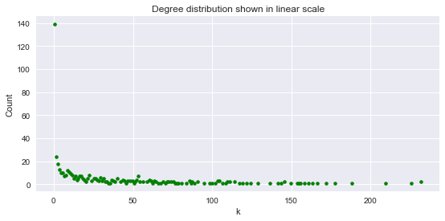
 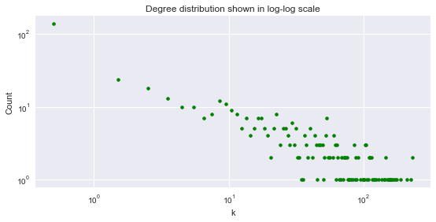
The animal subgraph follows a powerlaw degree distribution, like many networks in nature, meaning that most animals have low degrees and a few animals have high degrees. Let's now look at the top 20 most connected animals. This is equivalent with our initial definition of "smartest animals in town".
## Top 20 most connected animals

|Animal	| Degree|
|-------|------|
|bird|	235|
|dog|	229|
|cat	|222|
|fish	|197|
|dolphin	|179|
|primate	|176|
|fly	|168|
|chimpanzee|	165|
|whale	|162|
|elephant	|160|
|	parrot|	156|
|	crow	|155|
|	wolf|	154|
|	bear|	153|
|	cow|	146|
|	ape	|145|
|	mouse|	145|
|	monkey	|142|
|	rat	|141|
|	lion	|132|

And there we have it! Dolphins are there, so are rats, mice, whales, crows, in direct correlation with complexity of behavior. This indicates that our approach is correct. What was unexpected were flies and fish (could be since they're both verbs and nouns), and birds and dogs topping the top. A few of these animals could be explained by our bias towards our pets.

Although we have the top20 list, let's delve deeper into the analysis and see what else we can uncover.

## Community detection and finding animal families
For this we have used the Python Louvain algorithm implementation of community detection. The algorithm found the following communities:

* **Community 0**:
> peacock, cobra, antelope, rattlesnake, cougar, pufferfish|puffer fish, flamingo, peafowl, jaguar, snow leopard, puma, capybara, whippet, baboon, great white shark, mule, bee, orangutan, giant squid, turkey, crab, komodo dragon, tiger, wildcat, mountain goat, cat, shark, pony, squid, junglefowl, right whale, catfish, moose, unicorn, phalangeriformes|possum, hermit crab, wolf|wolves, okapi, hedgehog, cardinal|cardinal, aphid, jackal, panthera|panther, fennec fox|fennec, asian black bear, vulture, manatee, caterpillar, giraffe, flea, clam, dingo, sockeye salmon, hare, spider, lobster, mollusk, mustang, dinosaur, mantis|praying mantis, wolverine, cougar|puma, shrimp, sawfish, gopher|gopher, coral, dog|huski|dachshund|canine, flycatcher, horse, opossum, geococcyx|roadrunner, yak, serval, penguin, haddock, cicada, black panther, hornet, hammerhead shark, turkey|turkey, portuguese man o' war, tick, tapir, tiger shark, pointer|english pointer, barracuda, eel, 

* **Community 1**:
> pheasant, pigeon, corvids, nightingale, cockatoo, roundworm, grasshopper, sturgeon, land snail, tarantula, bird, ibis, cuckoo, peregrine falcon, wallaby, swan, duck, viperidae|viper, bumblebee, planarian, worm, warbler, thrush|thrush, rooster, mockingbird, beaver, quail, woodpecker, zebra finch, magpie, elephant, snail, hawk, dove, boa constrictor|constrictor, snake, falcon, boidae|boa, gorilla|silverback, goose, zebra, grebe, lark, carp, mite, albatross, louse, ostrich, octopus, gazelle, wasp, rook|rook, koi, stork, crow, hummingbird, cockatiel, kiwi, sparrow, fowl, gecko, koala, finch, toad, snipe, parakeet, frog|bullfrog, 

* **Community 2**:
> crocodile, condor, owl, seal, badger|badger, wildebeest, elephant seal, humpback whale, raccoon, weasel, alligator, coyote, egret, cheetah, leopard, jellyfish, calves, vole, raven, grouse, red fox, mouse|mice, reptile, bobcat, marten, prairie dog, grizzly bear, lynx, mink, marmot, ant, panda, polar bear, hyena, 

* **Community 3**:
> hyrax, marsupial, bear, bat, red squirrel, tasmanian devil, bison, orca, hippocampus|seahorse, lion, mole|mole, mosquito, chipmunk, stoat, squirrel, brown bear, bull, krill, bald eagle, otter, bison|american buffalo, cattle|cow|calves, coregonus|whitefish, vampire bat, salamander, megabat|fruit bat, crayfish, macaque, earthworm, wren, rodent, salmon, mongoose, bison|buffalo, american, bedbug, chickadee, red deer|elk, walrus, coypu, hippopotamus, giant panda, booby, cockroach, shrew, sea lion, ox, porpoise, meerkat, american black bear, guppy, whale, dung beetle, african wild dog, pinniped, pilot whale, centipede, butterfly, reindeer, scorpion, water buffalo, caribou, 

* **Community 4**:
> chicken, antlion, sloth, dragonfly, whooping crane, chameleon, crane|crane, ferret, llama, kangaroo, goldfish, swift, tortoise, hamster, sheep|ram|lamb, lemur, boar, macaw, pike|pike, goat|chamoix, ladybug, fly, dodo, lizard, pythonidae|python, wild boar, camel, rabbit|bunny, iguana, kangaroo rat, parrot, turtle, fox, monitor lizard, eagle, cattle, loon, asp|asp, red deer, toucan, golden eagle, donkey, guinea pig, anaconda, deer, pig, rat, cricket|cricket, skink, gila monster, skunk, locust, 

* **Community 5**:
> perch, jay, gull, minnow, porcupine, sea slug, canides, vaquita, bass|bass, cephalopod, red panda, termite, swallow, canid, ape, barnacle, african elephant, dolphin, beluga, tarsier, loris, primate, rainbow trout, moth, cod, tuna, blue whale, dragon, common blackbird|blackbird, mallard, spider monkey, heron, rajiformes|ray, sole|sole, lemming, marmoset, bonobo, beetle, neanderthal, gibbon, stingray, tree frog, trout, slug, lamprey, hominids, monkey, rhinoceros|rhino, fish, starfish, blue jay, bullfrog, rainbow trout|steelhead trout, arthropod|bug, titi, batoidea|ray, wombat, stink bug, manta ray, sperm whale, amphibian, chimpanzee|chimp

Although only 5 communities are found, so no hope for a proper biological classification in families, we can observe some interesting patterns.
For example:
* Community 0 and 2 have many predators
* Community 1 has almost all the birds and things they eat
* Community 5 appears to have all the primates and some other intelligent animals such as whales and dolphins

In the end, it appears that the communities found definitely show some patterns, so it may be worth looking further into them. For communities 3 and 4 we didn't find the underlying pattern and we leave it as an exercise for the reader to do so.
At the same time, an exercise left for the future would be to investigate subcommunities for each of the main communities, which may split the animals into their biological families.

# How do animals differ from each other? TF-IDF and Wordclouds!
We have taken the top 20 smartest animals and computed their TF-IDF based on their posts' text. Here're the Wordclouds!
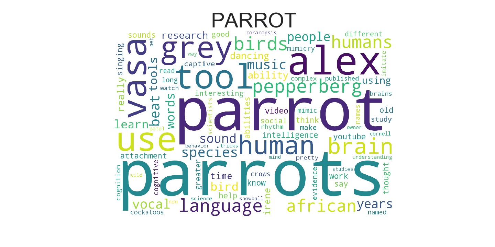 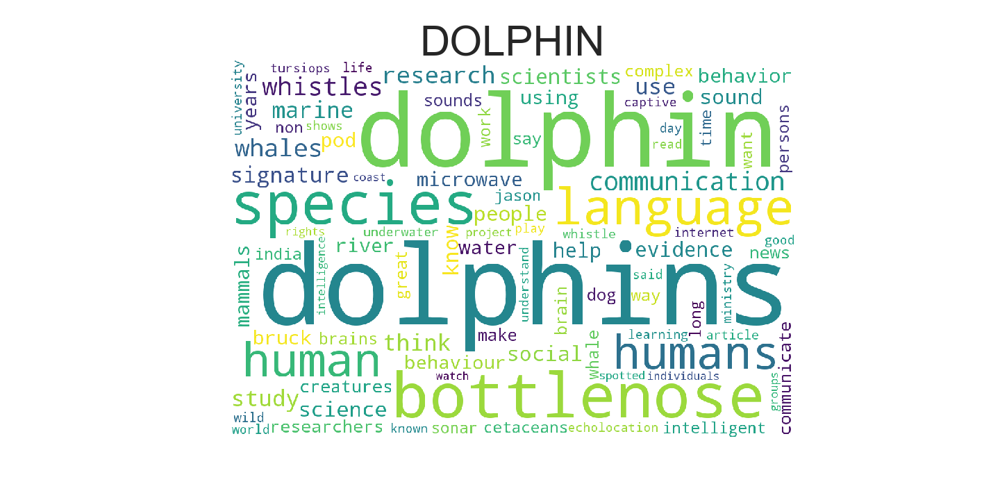
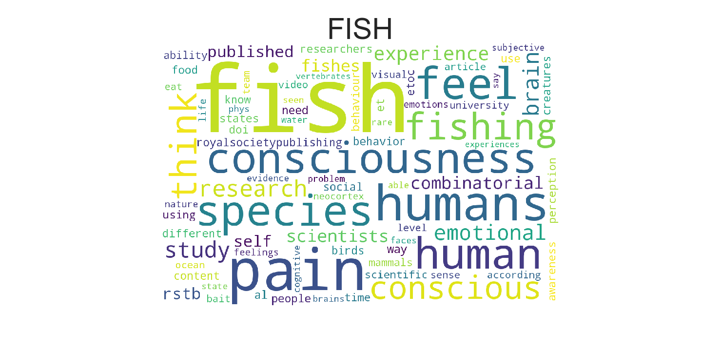 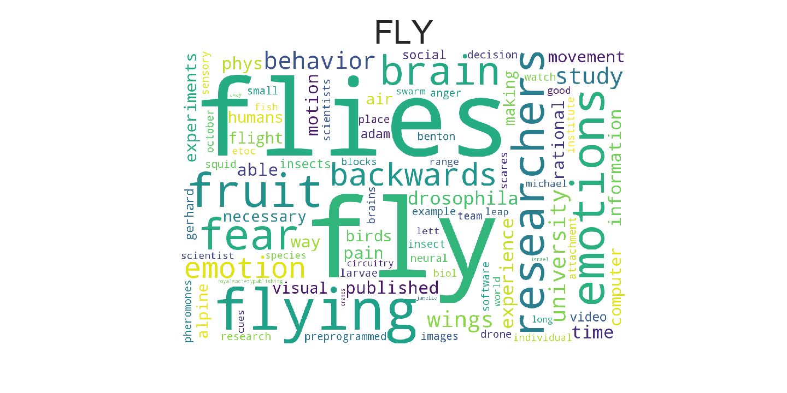
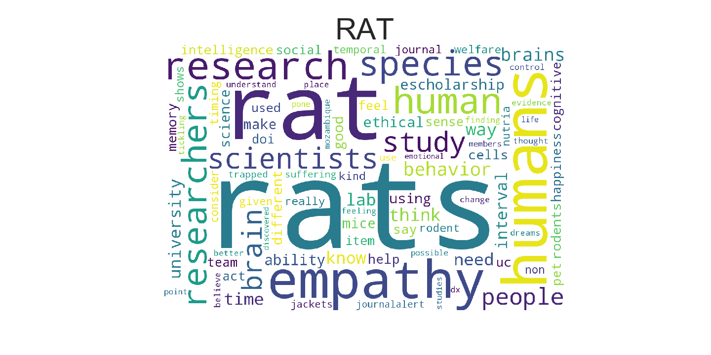 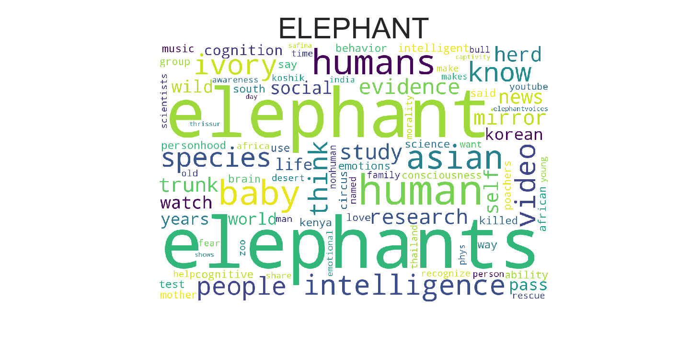
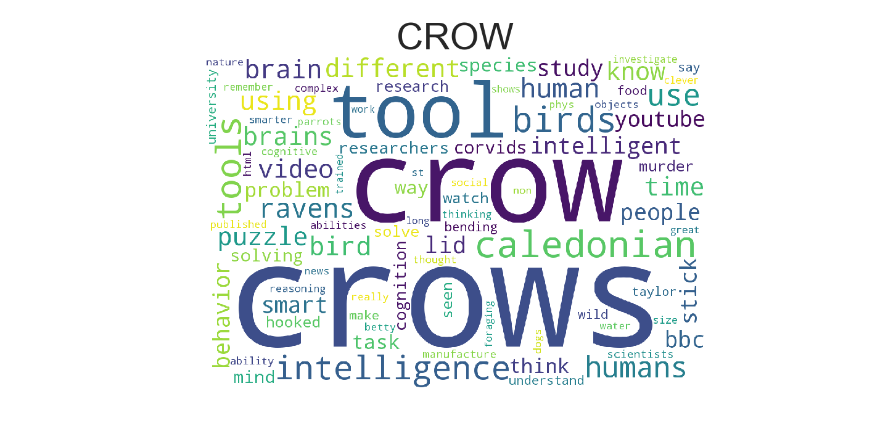 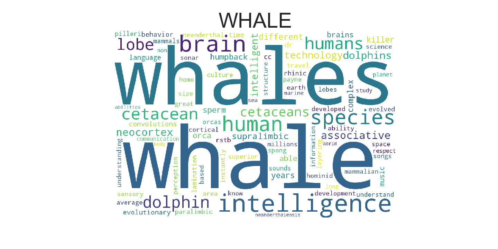
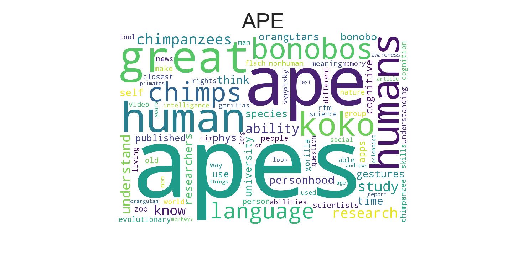 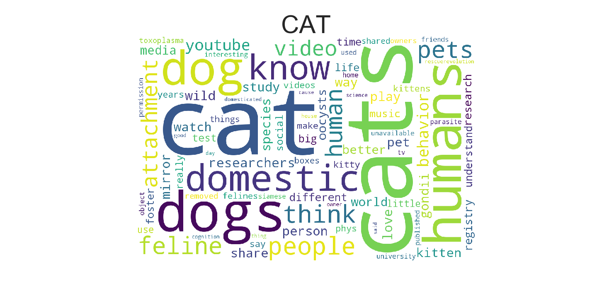
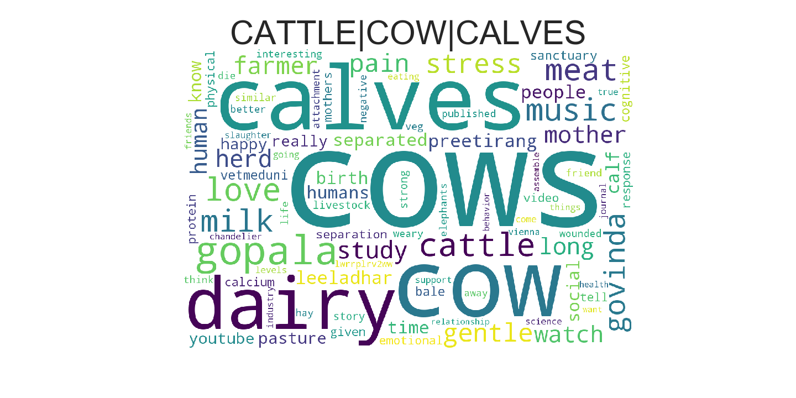 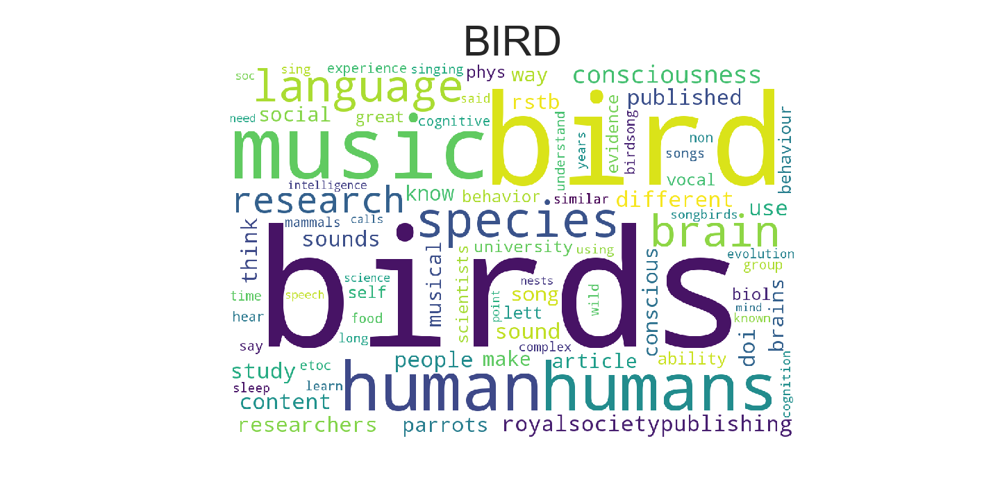
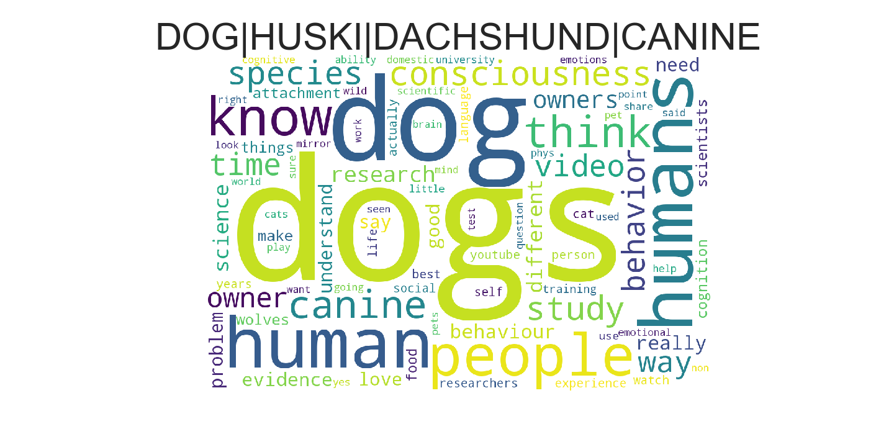 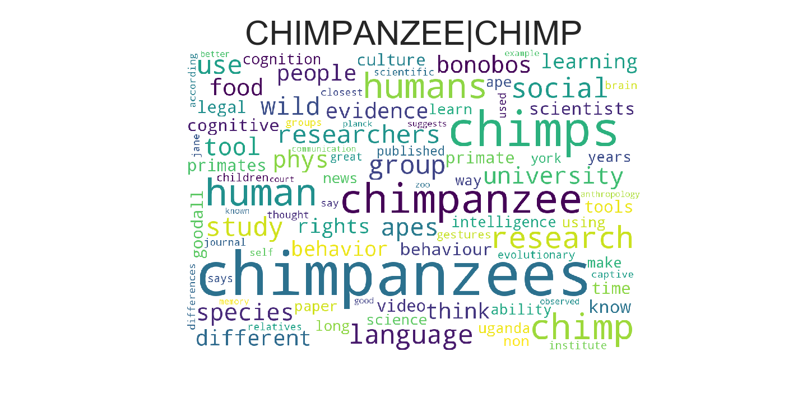 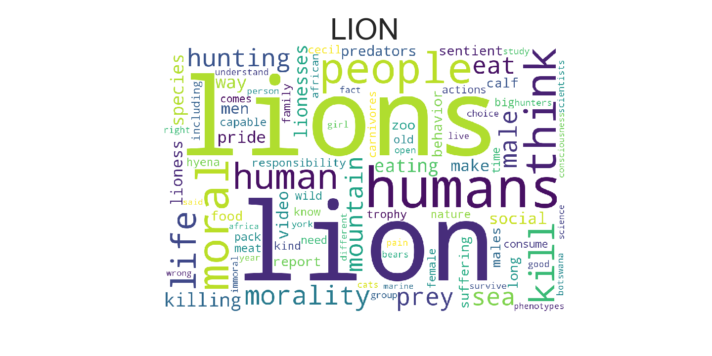
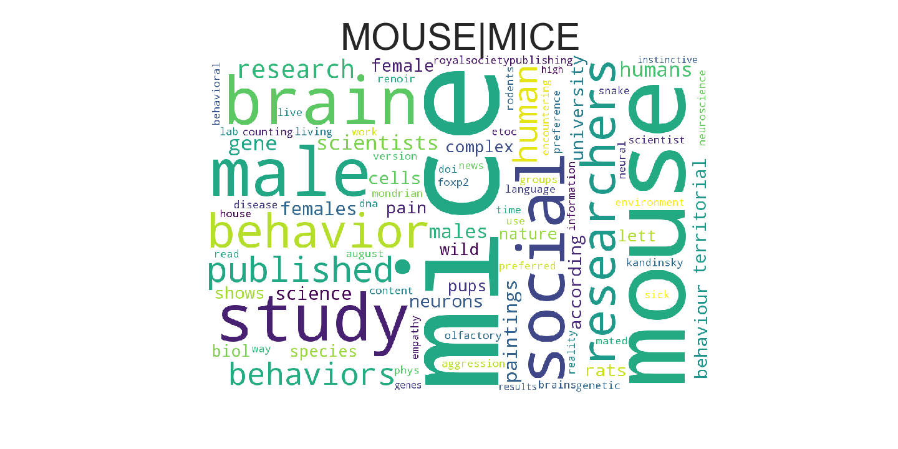 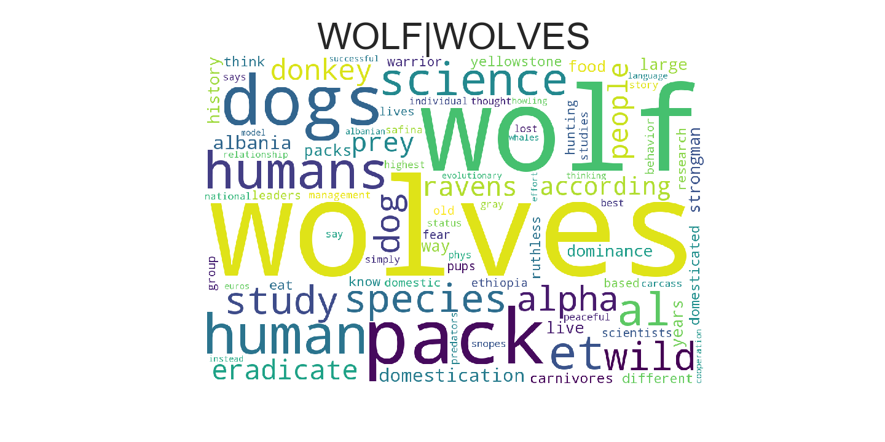 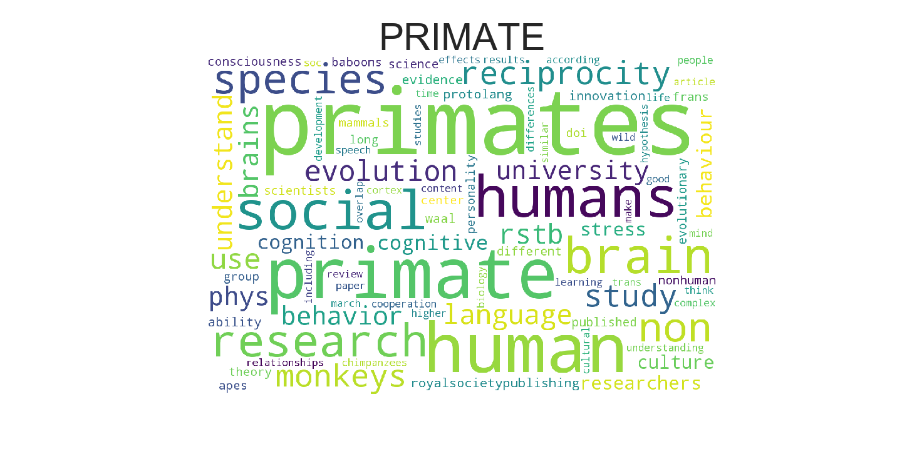 
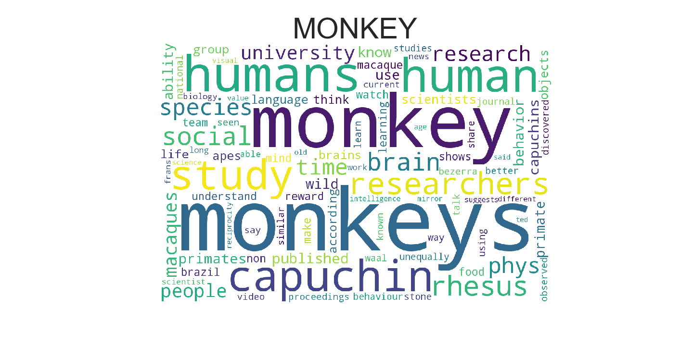 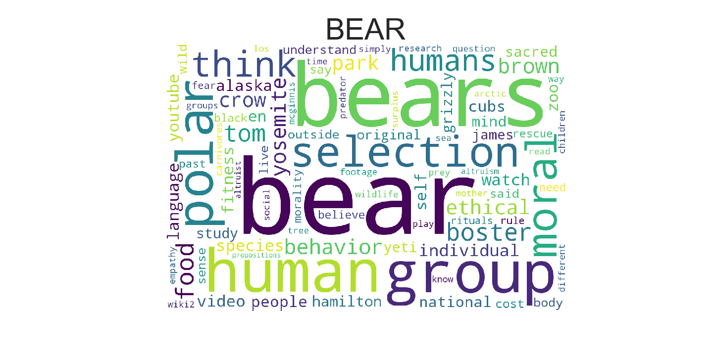

Solarized dark             |  Solarized Ocean
:-------------------------:|:-------------------------:
 | 

Plenty of interesting things appeared in the wordclouds ( tf-idf visualisations), some worth noting:
* Almost all wordclouds had the words "human", "humans","people", indicating anthropocentrism, in the sense that we compare everything other animals do to us.
* In **Parrot**, the names Alex and Pepperberg. Alex was an African Gray parrot that could answer and ask questions in English, count, and tell the difference between several types of objects. He was trained by Irene Pepperberg.
* In **Fly**, it can be seen that the word is related to both the insect(and the other insect:fruit flies), but also to birds due to the double meaning of the word.
* In **Fish**, "pain" is large due to people talking about whether fish feel pain.
* In **Rat**, one of the highest ranking words is "empathy", indicating what lots of studies have shown. There's also "ethical", "scientists", "research", which are related to them being used in the science lab. However, as the Hitchhiker's Guide tells us, they are actually studying us, hence all the science related words.
* In **Elephant**, one of the words is "mirror", which is related to elephants being able to pass the Mirror Test.
* In **Crows**: "puzzle", "hook", "problem solving", "tool" all indicate their incredible problem solving skills
* In **Whale**, interesting words are "convolutions", "culture", "neocortex", "sonar". In fact, dolphins have the largest neocortex in the whole animal kingdom (even larger than humans).
* **Ape** has "Koko", a gorilla that was taught American sign language. She's still alive today.

# Text Analysis - Collocations
* We checked for collocations to see if there are similarities in how people discuss about the intelligence of other animals.
* We also used in this analysis the method _collocations_ from the _nltk_ library applied to the tokenized text, concatenated from all posts.
* Some of the collocations turned out to be expressions that are very relevant to animal cognition and the way people feel and talk about animals such as:

   * _non human_
   * _facial expressions_
   * _animal cognition _
   * _decision making_
   * _problem solving_
   * _first time_
   * _self awareness_
   * _great apes_
   * _current biology_
   * _nonhuman animals_
   * _cognitive abilities_
   * _mirror test_
   * _nervous system_
   * _feel pain_
   * _animal behaviour_
   * _best friend_
   * _climate change_
   * _wildlife service_
   * _critically endangered_
   * _good article_
   * _animal rights_
   * _intellectual lives__

* Some other types of collocations showed that a lot of people research what they are posting about and talk about relevant sources:

   * scientist magazine
   * paper published
   * previously thought
   * study finds
   * scientific american
   * state university
   * peer reviewed
    
* Another thing we discovered was that in one of the groups, anthrozoology, there are a lot of Spanish speaking members, since a lot of the collocations are in spanish (los animales, perseguir lasl, las palabras etc.)
  
# Sentiment analysis

* We performed sentiment analysis on the text in the posts, in order to get a feeling of how people perceive the different animals.
* For performing sentiment analysis we used the The LabMT 1.0. (‘language assessment by Mechanical Turk 1.0’) list, which was created with the use of Amazon Mechanical Turk, which is a crowdsourcing service that provides 'human intelligence'. The top 5000 most frequent words from 4 sources (Twitter, Google Books, music lyrics, and the New York Times) were merged in a set of 10 222 words. These words were rated by users of Amazon Mechanical Turk, based on their _average happiness_, from 1 to 9.

 * By computing the average of all the words in all the posts in each group, we were able to determine the average sentiment of the 3 groups:
 
| Group        | Average Sentiment |
| ------------- |:-------------:|
| Animal Cognition     | 5.54518814266  |
| Animal Cognition, the Emotional and Intellectual Lives of Animals|5.56189498169     |
| Anthrozoology | 5.5083218857 | 

It turns out, people are optimistic when talking about animal intelligence, since the happiness of each group is above average.

* When performing sentiment analysis for each animal, these were the top animals:

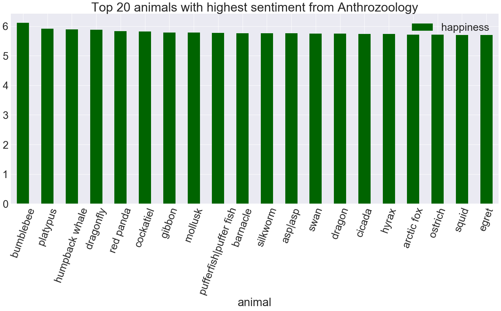

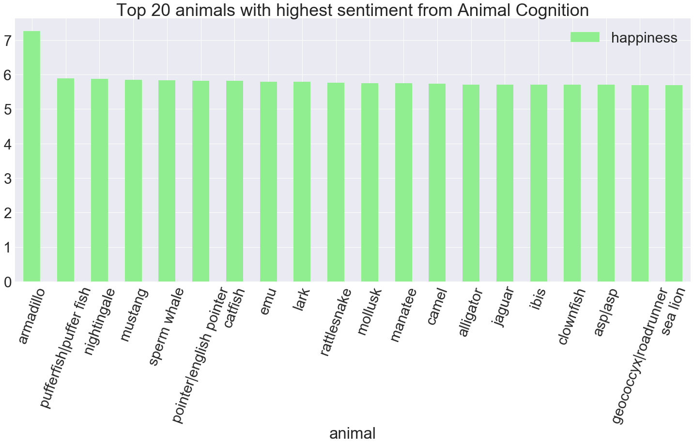

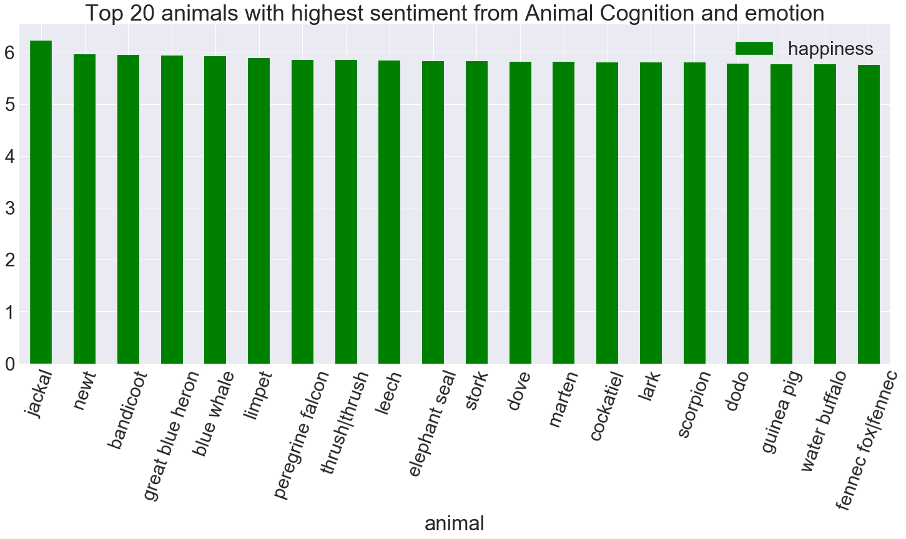

When looking at the last 20 animals in the happines ranks, we notice that they aren't very far from the top ones. From this we drew the conclusion that when people post or talk about an animal in these groups, it is mostly positive things.

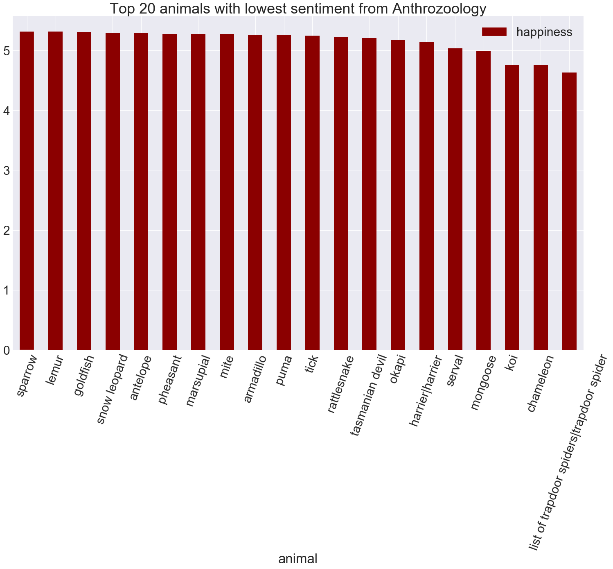

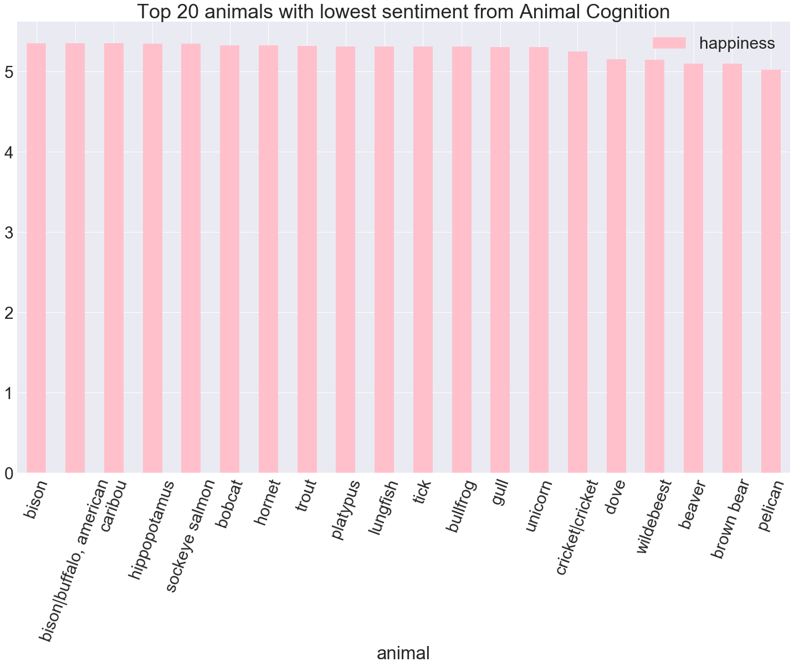

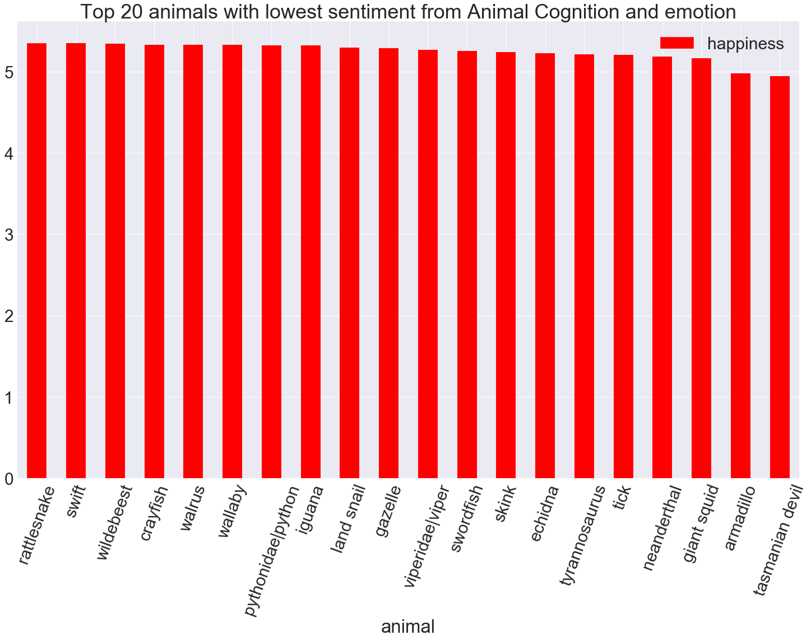

# Lexical Dispersion

* We were interested to see if there is a pattern in how the animals appear in posts throughout time.
* We sorted all the posts by date (from 2012 until present), then used the _dispersion\_plot_ method from the _nltk_ library. We checked for the first 50 animals most often encountered in the stemmed and tokenized text from all posts.
* The lexical dispersion plot looks very similar for the three groups and it is more or less constant, with some burstiness at some animals (for example  _bear_ and _lion_ in the graph below).

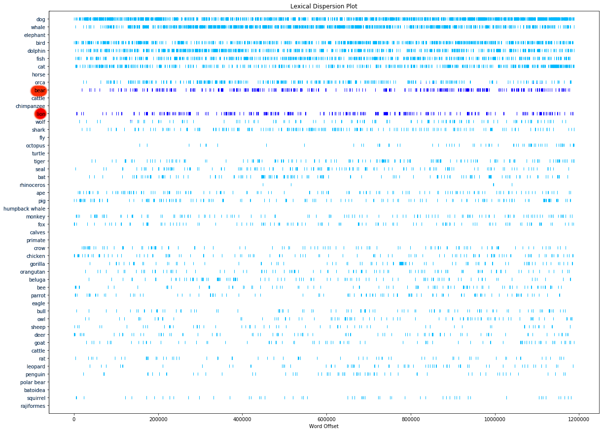

  # Top posters in each group
  
  * We checked for the members with the most posts, reactions and overall interactions (posts + reactions + comments) to get more info on how the people in the group behave.
  
  
  __Animal Cognition:__
  
  
  |    |Name                     | Number of comments| Number of posts| Number of Reactions| Total interactions
  |----|----                     |--------------------|---------------|--------------------|--------------------|
  |Most Posts|Robert Karl Stonjek|1120|3070|20|4210|
  |Most Reactions|Dmitri Kaminiar|28|366|2886|3280|
  |Most Comments|Robert Karl Stonjek|1120|3070|20|4210|
  |Most Interactions|Robert Karl Stonjek|1120|3070|20|4210|
  
  * In this group there are 2 dominant members who take part in most of the interactions and discussions.

  __Animal Cognition and Emotional Intelligence:__
  
  
  |    |Name                     | Number of comments| Number of posts| Number of Reactions| Total interactions
  |----|----                     |--------------------|---------------|--------------------|--------------------|
  |__Most Posts__|Susan Freeman|5514|21555|4059|31128|
  |__Most Reactions__|Susan Freeman|5514|21555|4059|31128|
  |__Most Comments__|Susan Freeman|5514|21555|4059|31128|
  |__Most Interactions__|Susan Freeman|5514|21555|4059|31128|
  
  * In this group we were surprised to see that there is only one person who does most of the posting, reacting and commenting.

  __Anthrozoology:__
  
  
  |    |Name                     | Number of comments| Number of posts| Number of Reactions| Total interactions
  |----|----                     |--------------------|---------------|--------------------|--------------------|
  |__Most Posts__|Manuel Fernandez Albores|270|1656|832|2758|
  |__Most Reactions__|Gala Argent|930|344|2994|4268|
  |__Most Comments__|Gala Argent|930|344|2994|4268|
  |__Most Interactions__|Piers Locke|1178|1486|1642|4306|
  
* In this group, we weren't surprised to see that the top poster was _Manuel Fernandez Albores_, since most of the collocations we found when analysing the text were in Spanish and he has a Spanish-sounding name.

# Top posters in all groups

* We also did the intersection of the members between the three groups, to see if we find any of the winners from the previous categories, who are being active in more than one group:

  |    |Name                     | Number of comments| Number of posts| Number of Reactions| Total interactions
  |----|----                     |--------------------|---------------|--------------------|--------------------|
  |__Most Posts__|Gala Argent|467|172|1744|2383|
  |__Most Reactions__|LizDonguri Capaldi Capybara|268|155|3134|3557|
  |__Most Comments__|Dennis Low|799|63|86|948|
  |__Most Interactions__|LizDonguri Capaldi Capybara|268|155|3134|3557|
 
* We have found one person who was in the top members in a group and three new persons, which may suggest that most people are only active in one group of their choice.

# Most liked animal in each group and in all groups

* We counted the reactions to the posts of which the animals were subject, to determine which are the most popular animals in each group:

__Top 10 animals__

|Animal Cognition||Anthrozoology||Animal Cognition and Emotional Intelligence||All 3 groups|
|----|------------|------------------------------||----------------|
|dog|dog||dog|dog|
|bird|elephant|elephant||elephant|
|cat|bird|whale||bird|
|chimpanzee|cat|bird||cat|
|elephant|horse|horse||whale|
|crow|wolf|cat||horse|
|monkey|chimp|dolphin||chimpanzee|
|dolphin|bear|cow||dolphin|
|fish|whale|bear||fish|
|parrot|fish|fish||bear|                                                                                           

The results are satisfactory, since they are close to the results obtained by analyzing the degree centrality. These animals are either really popular with humans(e.g. pets), or have complex behaviors in the wild (many have passed the Mirror Test).                                                                              

