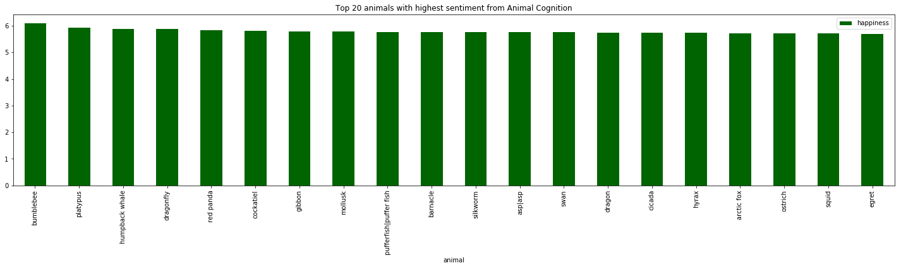
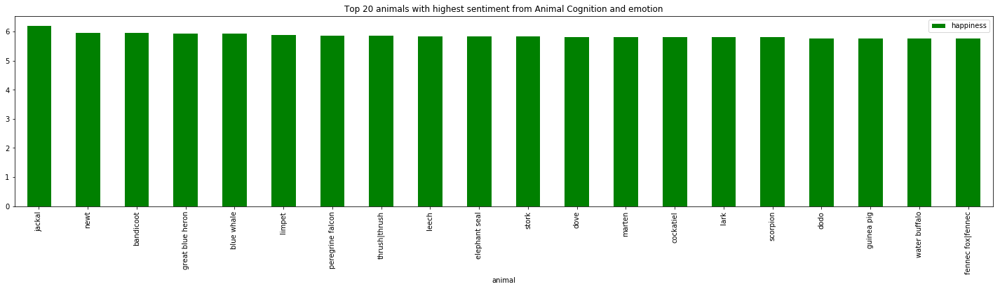
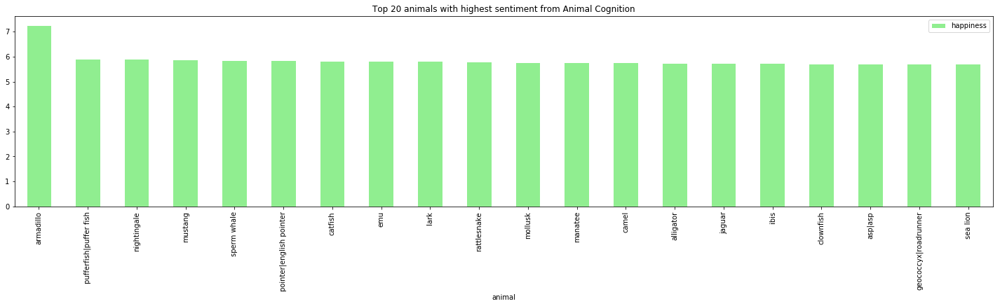

<iframe width="854" height="480" src="https://www.youtube.com/embed/tyh07c5I7eU" frameborder="0" gesture="media" allow="encrypted-media" allowfullscreen></iframe>

# Motivation
 We want to find out if humans have discovered yet that lab rats and dolphins are smarter than them so our question is: who’s the smartest animal in town? 

* __Choice of dataset__

We decided that these were the 3 most relevant Groups: Animal Cognition, Anthrozoology and Animal Cognition, the Emotional and Intellectual Lives of Animals. Since these facebook groups are all about science, more specifically the intelligence of animals, our assumption is that if a post on these groups mentions an animal, that animal must be smart.

* __Goal for the end user's experience__
>

# Basic stats about the dataset

The posts from 3 Facebook groups:

* Animal Cognition - 6 956 posts

* Animal Cognition, the Emotional and Intellectual Lives of Animals - 10 364 posts

* Anthrozoology - 7 442 posts

* 24 762 posts in total, 78.3 MB of pickles

# Sentiment analysis

* We performed sentiment analysis on the text in the posts, in order to get a feeling of how people perceive the different animals.
* For performing sentiment analysis we used the The LabMT 1.0. (_ ‘language assessment by Mechanical Turk 1.0’_) list, which was created with the use of Amazon Mechanical Turk, which is a crowdsourcing service that provides 'human intelligence'. The top 5000 most frequent words from 4 sources (Twitter, Google Books, music lyrics, and the New York Times) were merged in a set of 10 222 words. These words were rated by users of Amazon Mechanical Turk, based on their _average happiness_, __from 1 to 9. __
 * By computing the average of all the words in all the posts in each group, we were able to determine the average sentiment of the 3 groups:
 
| Group        | Average Sentiment |
| ------------- |:-------------:|
| Animal Cognition     | 5.54518814266  |
| Animal Cognition, the Emotional and Intellectual Lives of Animals|5.56189498169     |
| Anthrozoology | 5.5083218857 | 

It turns out, people are optimistic when talking about animal intelligence, since the happiness of each group is above average.

* When performing sentiment analysis for each animal, these were the top animals:

<a class="tar_download_link" href="https://github.com/JW0914/Wikis/tarball/master">tar</a>   |   <a class="zip_download_link" href="https://github.com/JW0914/Wikis/zipball/master">zip</a>

